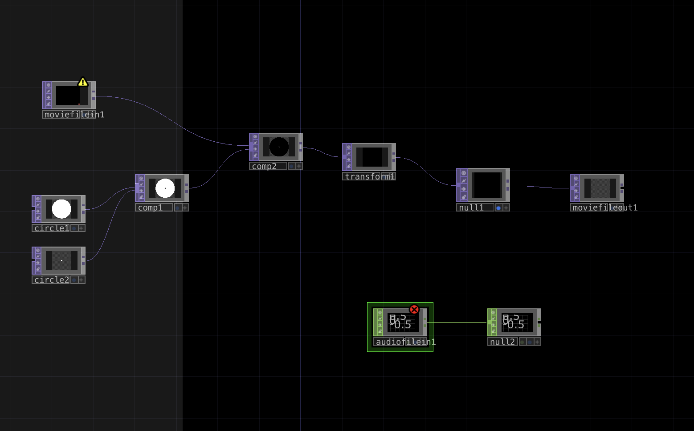
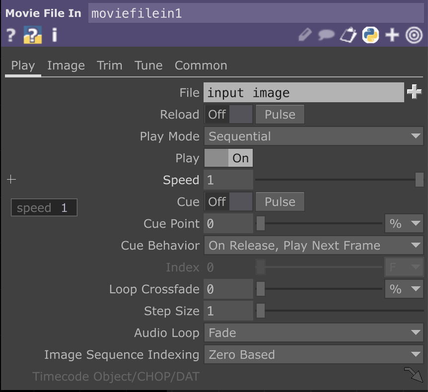
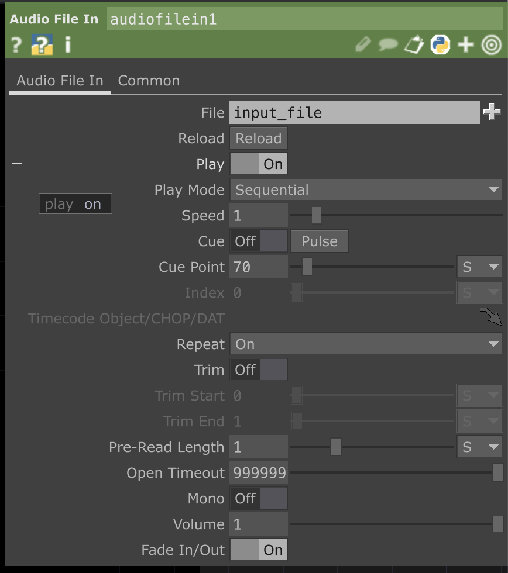
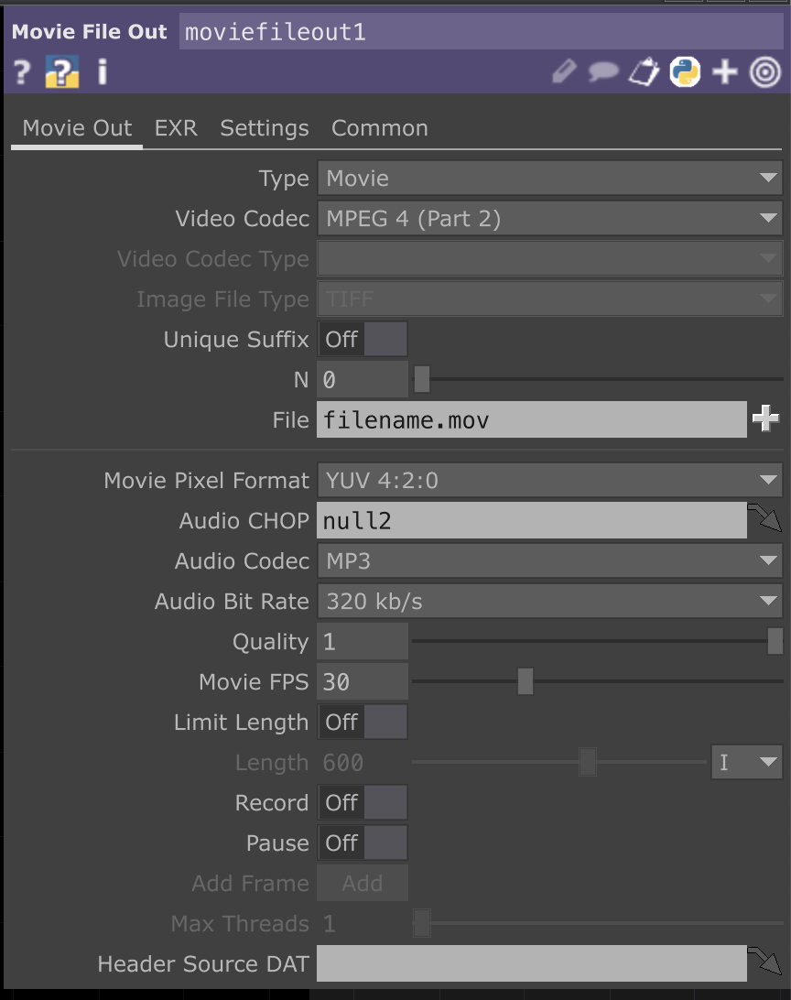
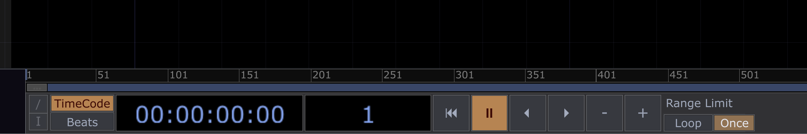
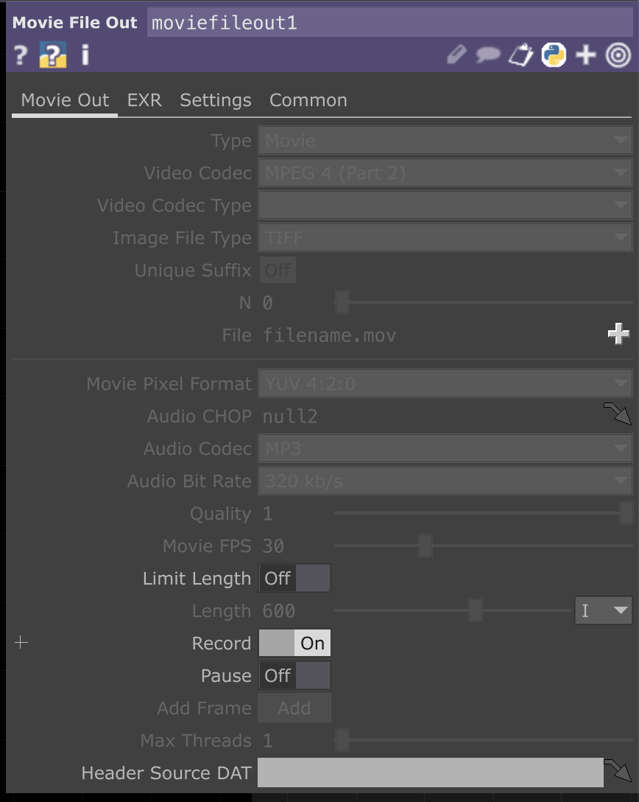
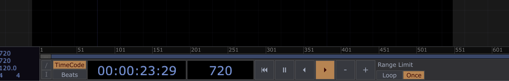
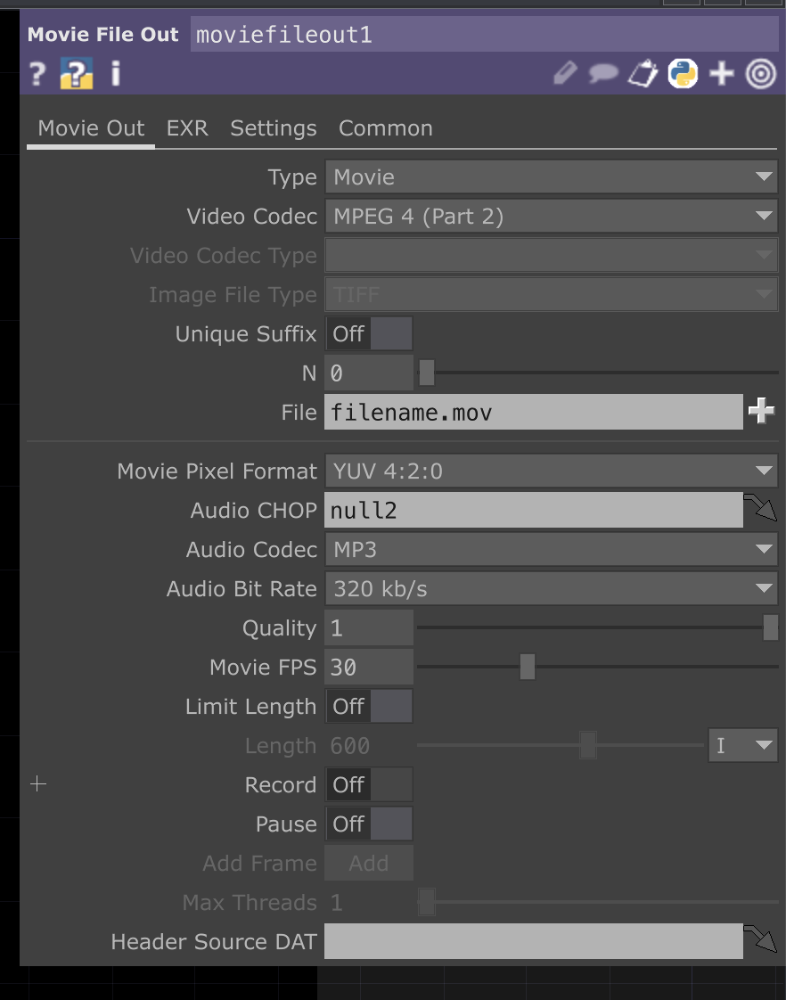
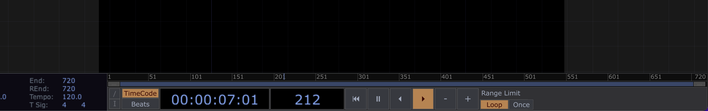

# td-cover-rotate
make your release cover rotate like vinyl including audio using this super simple touchdesigner template

Using Tis L's "Brot & Spiele" as an example

The example above was scaled down and we had to decrease the framerate to keep file size small you can export 1280x1280 pixels and up to 60fps using touchdesigner's free version.

## How to

1. This is the full td session - easy right :-)

    

1. Now go to the `moviefilein1` and replace the `input image` with the path to your cover or use the `+` to choose from your file system

    

1. Now go to `audiofilein1` and replace the input file just like above but use the audio file of your release this time, also here you can set the `Cue Point` which is the start point of your audio for the exported video (in seconds). Please note that when you start a new recording you have to click `Pulse` next to Cue to go back to your desired `Cue Point`.

    

    Great you should now be able to see the rotating video, there is no audio as it needs a lot of resources to play in realtime.

1. Now go to `moviefileout1` and set a file name for your exported video (and if you want change framerate or type or other here)

    

1. If all settings are correct, rewind your video using the transport controls and set it `Once`

    

1. Now go back to your `moviefileout1` and activate record

    

1. Next press play and wait for the 720 frames to finish, it will stop at the end of two rotations (you can increase the amount of full rotations by increasing the length of you td session)

    

1. Now this one is important to get a proper file output. To finish the recording after your the preview stopped rotating you have to deactivate record in the `moviefileout1` and then press the loop button so the preview continues rotating. I assume it saves on the next start of a td iteration so that's why it is needed to continue the video after deactivating record

    

    

    You did it you should now have a rotating cover including your music in the folder relative to this project.
